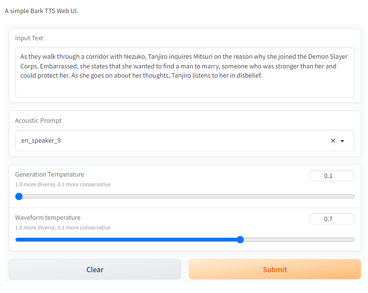

# Bark Web UI

### Installation

- `git clone https://github.com/makawy7/bark-webui`
- `pip install .`
- `pip install gradio`

### Usage

- `python webui.py`

Check out the [Bark](https://github.com/suno-ai/bark) for prompts and more information.
